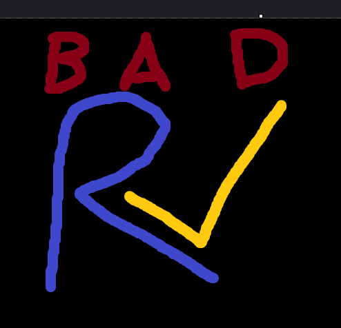

# brisc-v
Bad RISC-V. Thats it. 

Jokes aside, it seems fun to make a virtual machine project, and try and build a 
whole pseudo architecture off of it with other tooling. I saw a small youtuber 
doing this and thought it seemed fun!